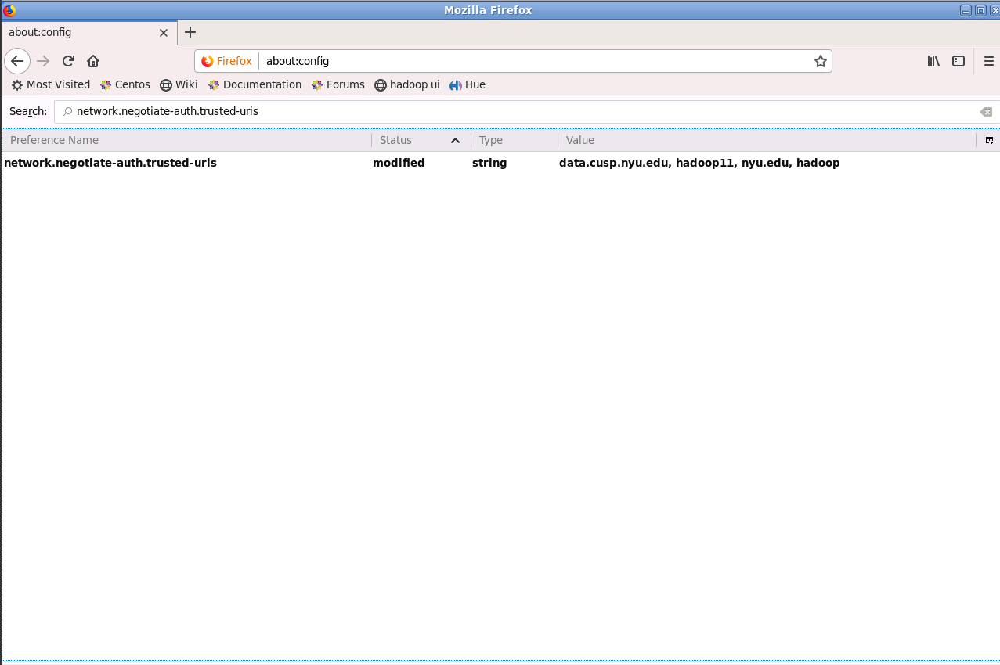

# Venpath on CUSP 

## Data

The data is currently located on CUSP's HDFS under `/scratch/pp1994/venpath/pings` and  `/scratch/pp1994/venpath/static`

There are two datasets - `pings` and `static`. 

`pings` contains all the time-variant data points, partitioned by year, month, date.

```
pings
 |-- ad_id: string (nullable = true)
 |-- lat: double (nullable = true)
 |-- lon: double (nullable = true)
 |-- timestamp: timestamp (nullable = true)
 |-- horizontal_accuracy: integer (nullable = true)
 |-- foreground: boolean (nullable = true)
```

`static` contains all the time-invariant data points, partition by year, month.
```
static
 |-- ad_id: string (nullable = true)
 |-- app_id: string (nullable = true)
 |-- id_type: string (nullable = true)
 |-- country_type: string (nullable = true)
 |-- device_make: string (nullable = true)
 |-- device_model: string (nullable = true)
 |-- device_os: string (nullable = true)
 |-- device_os_version: string (nullable = true)

```

You can join `pings` and `static` on `ad_id`.

## Accessing Data

We have 2 ways to access the data
1. Pyspark - interactive, but with heavy restrictions on resources (limited to 2 cores)
2. spark-submit - batch job, less restriction on resources (limited to 86 cores)

### 1. Pyspark

- Pyspark is the spark python API
- CUSP limits pyspark usage to 2 cores/user. So, at most you can gain 2x parallelism.    
```
$pyspark

Welcome to
      ____              __
     / __/__  ___ _____/ /__
    _\ \/ _ \/ _ `/ __/  '_/
   /__ / .__/\_,_/_/ /_/\_\   version 2.4.0
      /_/

Using Python version 3.7.2 (default, Dec 29 2018 06:19:36)
SparkSession available as 'spark'.

>>> # loads data from 2016/6/1
>>> df = spark.read.parquet("/scratch/pp1994/venpath/pings/year=2016/month=6/date=1")

>>> # You can also use wildcards. loads data from all of 2016
>>> df = spark.read.parquet("/scratch/pp1994/venpath/pings/year=2016/month=*/date=*")

>>> # static data for 2017/6
>>> static_df = spark.read.parquet("/scratch/pp1994/venpath/static/2017_6")

>>> # all static data
>>> static_df = spark.read.parquet("/scratch/pp1994/venpath/static/*")

```

### 2. spark-submit 

- spark-submit is used to run batch applications with python
- CUSP limits spark-submit usage to 86 cores/user. 

For example, to run the get_processed_counts.py script from shell:
```
$ spark-submit --num-executors 86 jobs/get_processed_counts.py
```

There are many command line options to set number of executors, memory of executor, driver etc. See here for all options: 
https://jaceklaskowski.gitbooks.io/mastering-apache-spark/spark-submit.html

The most important options are --num-executors, --executor-memory, --driver-memory

See [jobs.sh](jobs.sh) for sample commands. 

#### To use python3.7 with spark-submit:

```
$scl enable miniconda3 bash
$export PYSPARK_DRIVER_PYTHON=/opt/cdp/miniconda3/bin/python
$export PYSPARK_PYTHON=/opt/cdp/miniconda3/bin/python
```

## Monitoring Jobs
 

### Cloudera HUE 
- https://data.cusp.nyu.edu/hue/accounts/login
- HUE (Hadoop User Interface) lets you monitor running jobs at a high level. You can also access logs here.

### SPARK UI

- On Spark UI, you can dive deeper into a particular job in more detail (see resources being used, which specific task is failing etc)

To access Spark UI
1. Log into Linux RDP on CUSP (https://serv.cusp.nyu.edu/dash_beta/#/)
2. Start mozilla and change the following settings in about-config:

3. Go to the Tracking URL (found in HUE --> job --> properties)

### Logs

You can export the entire log to a text file. Application ID of the job can be found in HUE. 
```
yarn logs -applicationId <YOUR_APPLICATION_ID> > logs.txt  
```


## Resources

- Intro to Spark Dataframes: https://docs.databricks.com/spark/latest/dataframes-datasets/introduction-to-dataframes-python.html 
- Spark-sql documentation: https://spark.apache.org/docs/latest/sql-programming-guide.html
- Mastering Apache Spark: https://jaceklaskowski.gitbooks.io/mastering-apache-spark/
- Pyspark Cheatsheet: https://s3.amazonaws.com/assets.datacamp.com/blog_assets/PySpark_Cheat_Sheet_Python.pdf
